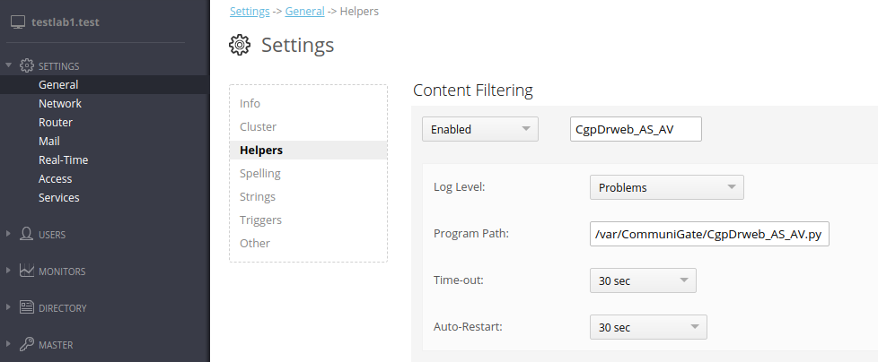
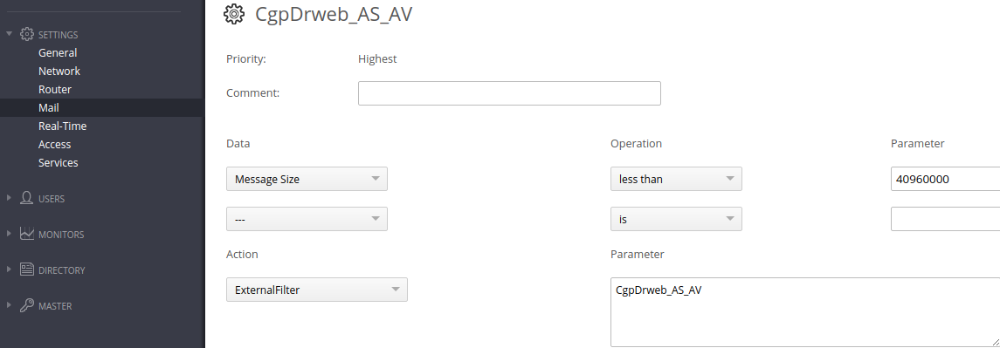
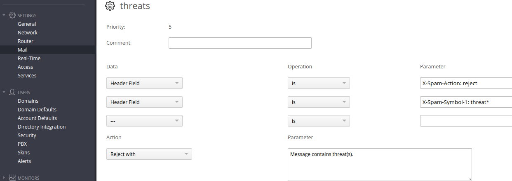
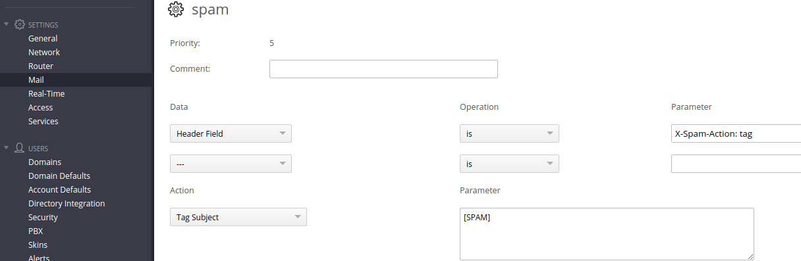

[](https://www.paypal.com/cgi-bin/webscr?cmd=_s-xclick&hosted_button_id=A5564C87QCFH4&source=url)
[](https://www.python.org/download/releases/3.0/)
[](https://download.geo.drweb.com/pub/drweb/unix/mail/11.1/documentation/html/en/)
[](https://github.com/delatars/CgpDrweb)

# Communigate Pro + drweb-mail-servers


## Description
drweb-mail-servers 11.1 support a new version of Rspamd protocol(via HTTP)
```bash
drweb-ctl cfshow MailD.RspamdHttpSocket
```

The plugin is designed to integrate with DrWeb virus and spam detection services via Rspamd HTTP protocol

The plugin is launched in CommuniGate Pro as External Filters.

## Features
- Cross-Platform
- No Third-Party Dependencies
- Support tcp and unix sockets
- Runs from any directory
- Allow use drweb-maild Rspamd lua rules([Dr.Web Email Processing in Lua](https://download.geo.drweb.com/pub/drweb/unix/mail/11.1/documentation/html/en/dw_9_maild_lua.htm))

## Installation
**Download plugin.**
```bash
$ cd /var/Communigate
$ wget https://github.com/delatars/CgpDrweb/raw/master/CgpDrweb_AS_AV.py
$ chmod +x CgpDrweb_AS_AV.py
```
**Edit Settings.**
```bash
$ vi CgpDrweb_AS_AV.py
```
```python
# ################### SETTINGS ###########################

# Set socket on which drweb Rspamd HTTP listen (drweb-ctl cfshow maild.rspamdhttpsocket --value)
# Examples:
#   tcp socket: 127.0.0.1:8020
#   unix socket: /tmp/drweb.socket
RSPAMD_HTTP_SOCKET = "127.0.0.1:8020"
# Communigate pro working directory
CGP_PATH = "/var/CommuniGate"

# ########################################################
```
**Add helper in Communigate Pro.**


**Add rule in Communigate Pro.**


**Now all messages less than 40Mb will be checked with drweb maild and have an additional headers:**
- X-Spam-Score
- X-Spam-Threshold
- X-Spam-Action

All Symbols will be unpacked to iterated additional headers:
- X-Spam-Symbol-1
- X-Spam-Symbol-2
- X-Spam-Symbol-3
- ...

## Test plugin
```bash
$ wget https://github.com/delatars/CgpDrweb/raw/master/CgpDrweb_AS_AV.py
$ wget https://github.com/delatars/CgpDrweb/raw/master/sample_spam.eml
$ python3 CgpDrweb_AS_AV.py
* CGP DrWeb Rspamd plugin version 1.0 started
```
**Input command.**
```
1 FILE sample_spam.eml
```
**You get response.**
```
1 ADDHEADER "X-Spam-Score: 300.0\eX-Spam-Threshold: 100.0\eX-Spam-Action: \eX-Spam-Symbol-1: Spam score (300.0) " OK
```

## Rules example

**Set drweb rspamd hook**
```bash
drweb-ctl cfset MailD.RspamdHook "<path to hook>"
```
hook
```lua
-- Entry point to check email message sent to the Dr.Web MailD by Rspamd protocol
function rspamd_hook(ctx)
-- Check the message for threats.
    if ctx.message.has_threat() then
        return {
            score = 900,
            threshold = 100,
            action = "reject",
            symbols = {
                {
                    name = "threat",
                    score = 900
                }
            }
        }
    end

    -- Check the message for spam.
    if ctx.message.spam.score > 100 then
        return {
            score = ctx.message.spam.score,
            threshold = 100,
            action = "tag",
            symbols = {
                {
                    name = "spam",
                    score = ctx.message.spam.score
                }
            }
        }
    end

    return {
            score = ctx.message.spam.score,
            threshold = 100,
            action = "accept",
            symbols = {
                    {
                        name = "The message is clean",
                        score = 0
                    }
                }
            }
end
```
**Add rules in Communigate Pro.**

Threats

Spam

